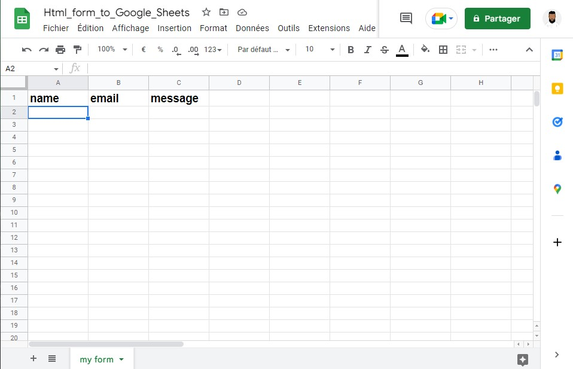
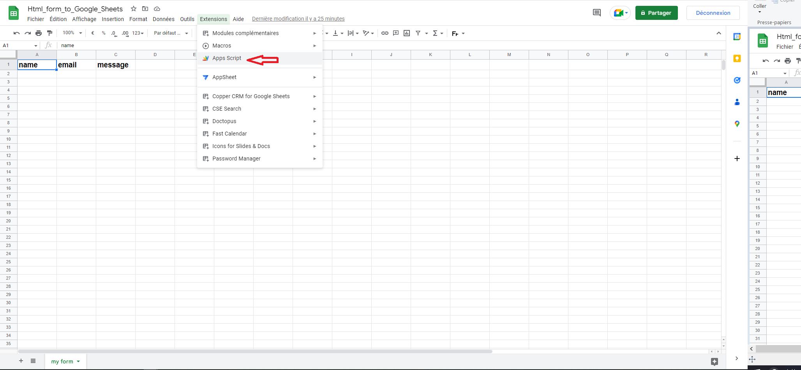
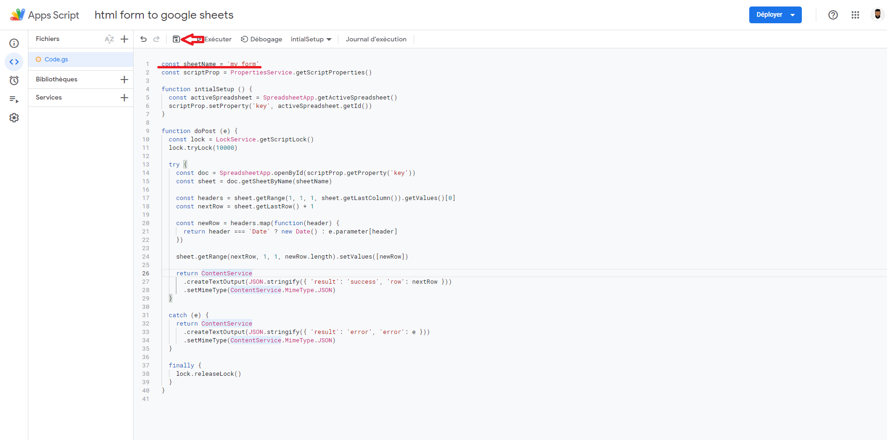
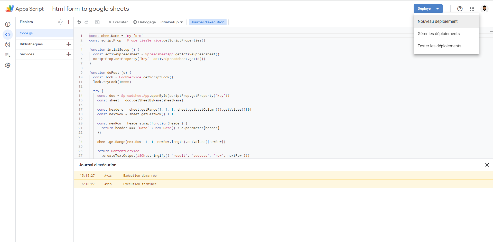
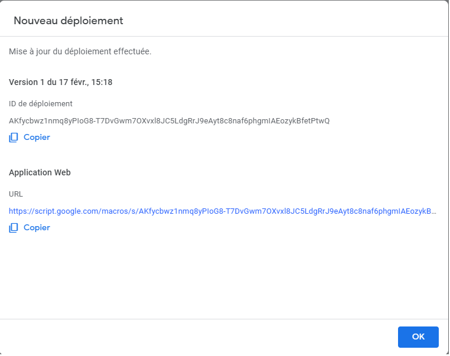

# Html-form-to-Google-Sheets

## This is a tutorial on how to transfer data from a simple html form to a google sheet

### By Yassine Labhih : full-stack developer https://yassinelabhih.com/


## Step 1

Create a basic HTML form with the inputs of your choice. 
:warning: Give a name to each of your inputs. they are important they are reused later


## Step 2
- Create a new Google Sheets document
- Give a name to the documents and the sheet
- Give each column the name of your inputs previously chosen in your form



## Step 3
- Open the extension App Script


- Name your project

- In Code.gs replace : '
'function myFunction() {
  
}'

by this code (You can found this code in [Link to the App Script code](appscript.js) )

```
const sheetName = 'ENTER_YOUR_SHEET_NAME'
const scriptProp = PropertiesService.getScriptProperties()

function intialSetup () {
  const activeSpreadsheet = SpreadsheetApp.getActiveSpreadsheet()
  scriptProp.setProperty('key', activeSpreadsheet.getId())
}

function doPost (e) {
  const lock = LockService.getScriptLock()
  lock.tryLock(10000)

  try {
    const doc = SpreadsheetApp.openById(scriptProp.getProperty('key'))
    const sheet = doc.getSheetByName(sheetName)

    const headers = sheet.getRange(1, 1, 1, sheet.getLastColumn()).getValues()[0]
    const nextRow = sheet.getLastRow() + 1

    const newRow = headers.map(function(header) {
      return header === 'Date' ? new Date() : e.parameter[header]
    })

    sheet.getRange(nextRow, 1, 1, newRow.length).setValues([newRow])

    return ContentService
      .createTextOutput(JSON.stringify({ 'result': 'success', 'row': nextRow }))
      .setMimeType(ContentService.MimeType.JSON)
  }

  catch (e) {
    return ContentService
      .createTextOutput(JSON.stringify({ 'result': 'error', 'error': e }))
      .setMimeType(ContentService.MimeType.JSON)
  }

  finally {
    lock.releaseLock()
  }
}

```

### - :warning: Attention on line 1 you must enter the name of your sheet the name must match exactly for it to work !

- Save the project

- Deploy the project 

- Select web app

- First field : Add a description of your choice
- Second field : select Me (yourmail@gmail.com)
- Third field : select Anyone

- Deploy
- A new window opens : Copy the URL !


## Step 3

- Go to your form code and copy the URL in the action field



```
const scriptURL = 'ENTER_THE_WEB_APP_URL'
const form = document.forms['ENTER_YOUR_FORM_NAME']

form.addEventListener('submit', e => {
    e.preventDefault()
    fetch(scriptURL, { method: 'POST', body: new FormData(form) })
        .then(response => alert("Thank you! your form is submitted successfully."))
        .then(() => { window.location.reload(); })
        .catch(error => console.error('Error!', error.message))
})
```


